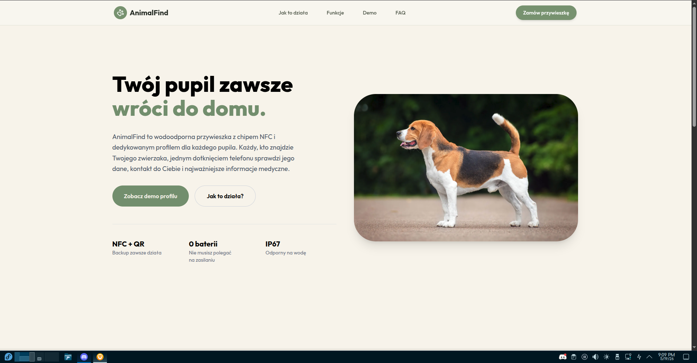
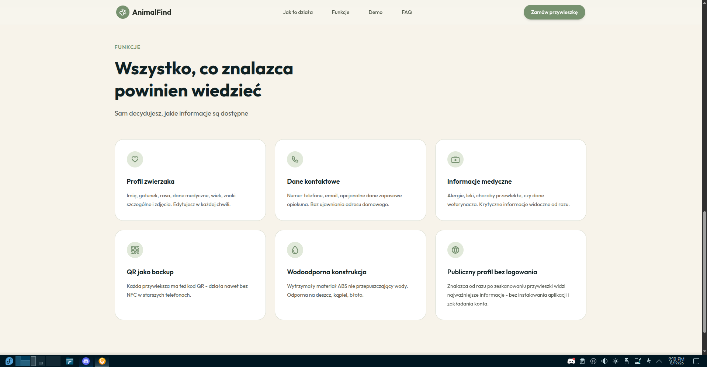
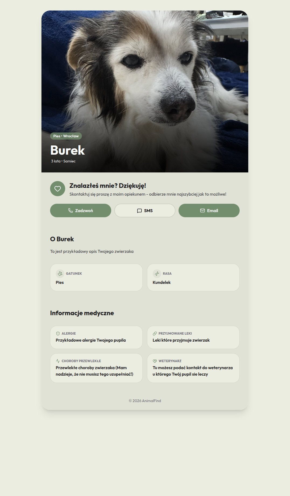

# AnimalFind - NFC pet identity system

## Currently features

- UUID identification
- Pet management
- Public profiles
- Demo profile
- Landing page

  ## Roadmap & To Do

  ### Frontend
  - [ ] Make code more responsive
  - [ ] Add the remaining subpages
  - [ ] Add smooth transitions and micro animations

  ### Backend
  - [ ] Improve auth system
  - [ ] Add image uplouds & compress

  
<b>Click to see screenshots </b>

 
<table border="0">
  <tr>
    <!-- left -->
    <td width="60%" text-align="center" valign="middle">
      
        
      
    </td>
    <!-- right -->
    <td width="50%" text-align="center" valign="middle">
      
    </td>
  </tr>
</table>

